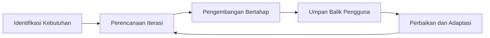
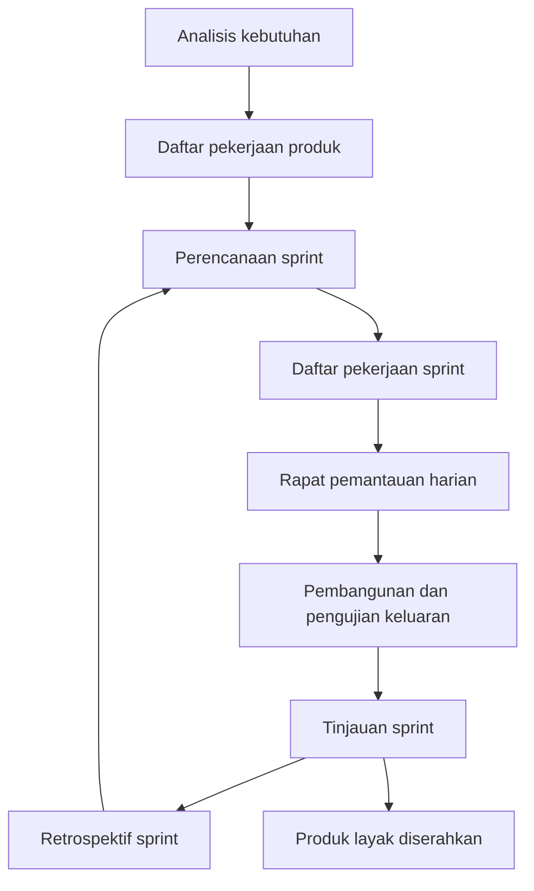

# Prosedur Penelitian

Prosedur penelitian ini disusun sebagai pedoman untuk merancang dan mengembangkan sistem informasi pendaftaran Kursus Persiapan Pernikahan di Biara Loresa SCJ SP3 berdasarkan hasil wawancara, observasi lapangan, serta dokumen kebutuhan pengguna yang telah terkumpul. Penelitian menggunakan pendekatan Agile karena pengembangan sistem direncanakan secara iteratif, kolaboratif, dan adaptif terhadap perubahan kebutuhan pengguna. Metode yang digunakan adalah Scrum, yaitu kerangka kerja yang membagi proses pengembangan ke dalam siklus *sprint* mulai dari analisis kebutuhan, penyusunan daftar pekerjaan produk, perencanaan iterasi, pembangunan bertahap beserta pengujian keluaran, hingga tinjauan dan evaluasi. Melalui prosedur ini, setiap tahap pengembangan dapat ditinjau dan disempurnakan secara terukur sampai menghasilkan sistem yang siap digunakan.

## Pendekatan Penelitian 

Pendekatan penelitian yang digunakan adalah Agile. Pendekatan ini menekankan proses iteratif, kolaborasi aktif dengan pengguna, dan kemampuan adaptasi terhadap perubahan kebutuhan selama pengembangan sistem berlangsung.

Gambar 3.2 Kerangka Pendekatan Agile

Diagram pendekatan Agile menunjukkan siklus berulang dari identifikasi kebutuhan, perencanaan, pengembangan, umpan balik, hingga adaptasi. Pola ini memastikan sistem yang dikembangkan tetap relevan dengan kebutuhan nyata pengguna pada layanan KPP.

## Metode Pengembangan Sistem 

Metode pengembangan sistem yang digunakan adalah Scrum sebagai kerangka kerja dalam pendekatan Agile. Metode ini dipilih karena mampu membagi pekerjaan ke dalam *sprint*, mengatur prioritas fitur melalui daftar pekerjaan produk, memantau kemajuan harian, serta mengevaluasi hasil tiap keluaran iterasi secara berkala sampai sistem siap digunakan.

Gambar 3.3 Kerangka Metode Scrum

Diagram metode Scrum memperlihatkan alur operasional pengembangan mulai dari pencatatan kebutuhan hingga produk yang layak diserahkan pada akhir iterasi. Setelah retrospektif *sprint*, proses kembali ke perencanaan *sprint* berikutnya hingga seluruh kebutuhan prioritas sistem terpenuhi.

## Metode evaluasi penelitian

Evaluasi kebergunaan dengan *System Usability Scale* disusun sebagai **langkah penelitian** untuk mengukur persepsi kemudahan pemakaian secara terstandar. Langkah ini **bukan** ritual Scrum yang mendefinisikan Scrum, melainkan pelengkap yang dijadwalkan **setelah** seluruh *increment* pada *product backlog* prioritas terintegrasi dan produk layak didemonstrasikan, sehingga responden menilai pengalaman pada sistem yang utuh. Rincian evaluasi kebergunaan per *sprint* dan prosedur *System Usability Scale* diuraikan pada subbab *Evaluasi Penelitian*; ringkasan skor dan interpretasi menjadi bagian hasil pada Bab IV.