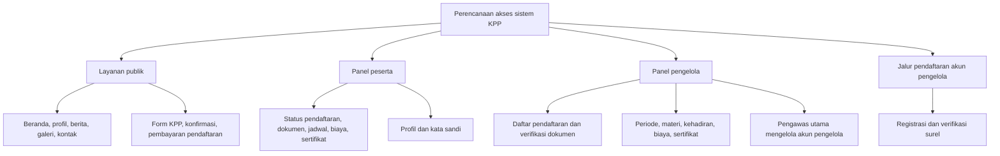
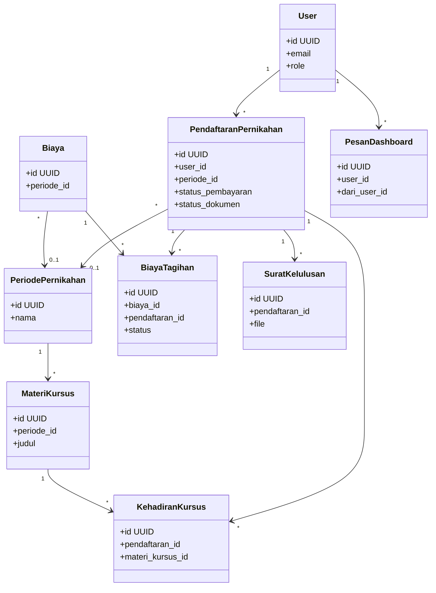
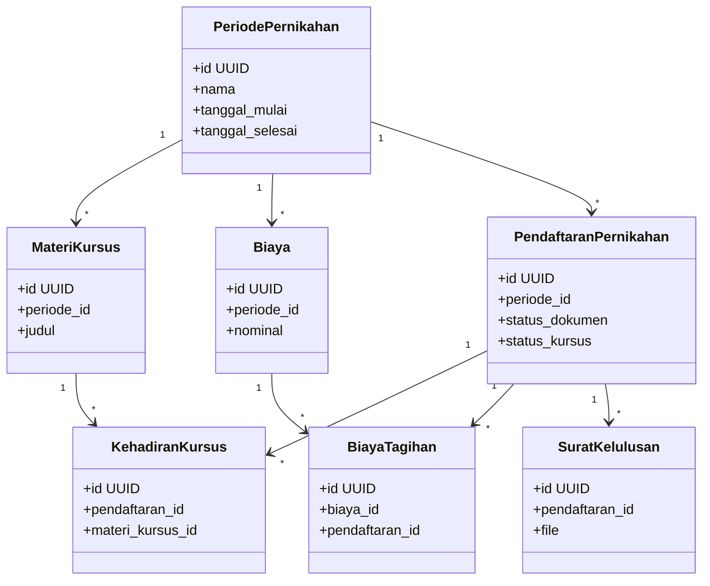
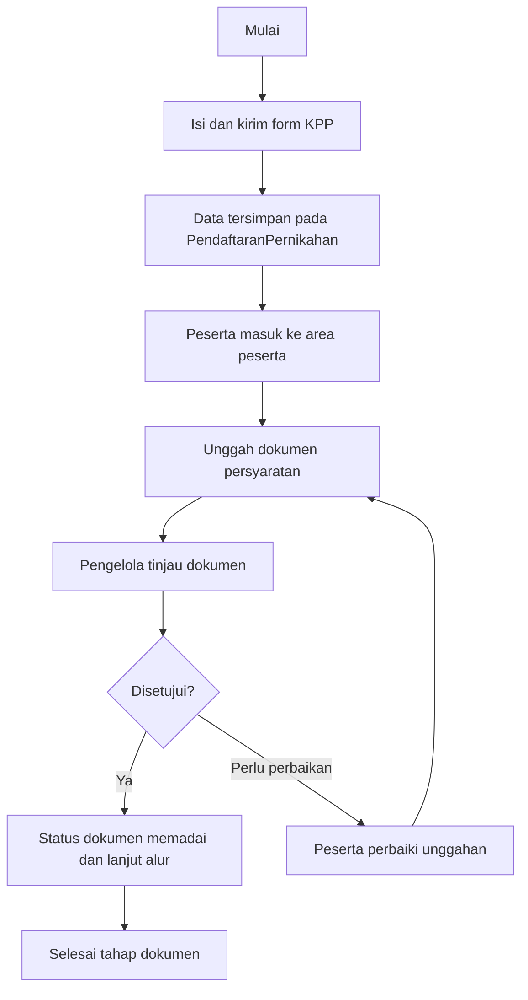
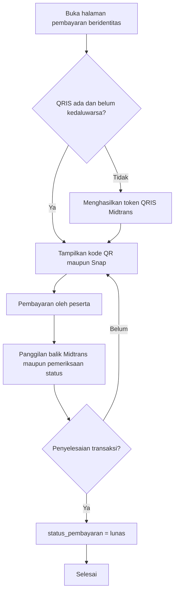
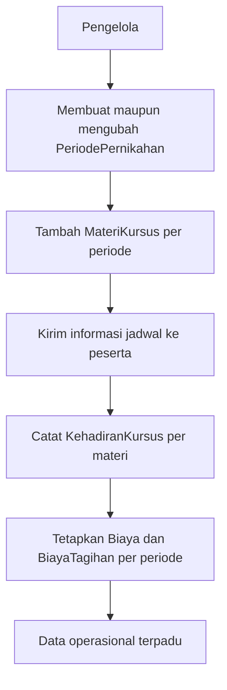
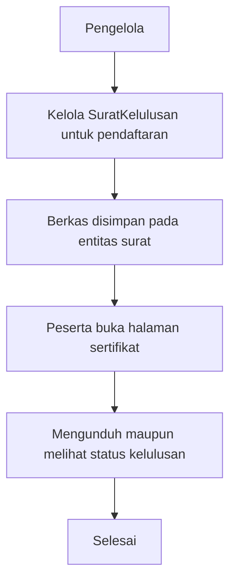

# Requirement

**Kebutuhan sistem** pada literatur rekayasa perangkat lunak sering disebut *requirement*. Istilah tersebut menyatakan apa yang harus dipenuhi oleh suatu sistem informasi agar layanan berjalan sesuai harapan pengguna dan pembimbing organisasi. Pengelompokan lazim membedakan kebutuhan fungsional yang meliputi perilaku layanan, data, dan alur kerja, serta kebutuhan non-fungsional yang meliputi kinerja, keamanan, dan lingkungan operasi. Keduanya menjadi dasar perancangan, prioritas pengembangan, dan pengujian.

Penelitian ini merancang sistem informasi pendaftaran untuk Kursus Persiapan Perkawinan, selanjutnya disebut KPP, di Biara Loresa SCJ SP3. Identifikasi kebutuhan mengacu pada **wawancara pada 15 Februari 2026** bersama **Pastor Markus Apriyono**, SCJ, selaku Direktur Biara, yang memetakan seluruh alur layanan dari pendaftaran hingga sertifikat. Temuan lapangan menunjukkan bahwa pendaftaran, berkas, dan administrasi biaya masih banyak bersifat tidak terkomputerisasi dan tidak terpadu, sehingga verifikasi memakan waktu dan ketertelusuran data peserta kurang konsisten. Atas dasar itu diperlukan sistem terintegrasi yang mendukung unggah dan verifikasi dokumen, pembayaran tercatat, serta layanan informasi bagi peserta dan pengelola.

Untuk menyajikan kebutuhan fungsional secara ringkas dan terarah sebelum dilanjutkan ke infrastruktur, diagram, dan perincian lainnya pada subbab berikut, ringkasan **fitur utama** beserta **keterangan** pelaksanaannya dalam empat tema besar layanan KPP disajikan pada **Tabel 1**.

**Tabel 1 Ringkasan fitur utama kebutuhan fungsional sistem KPP**

| No  | Fitur                                                       | Keterangan                                                                                                                                                                                    |
| --- | ----------------------------------------------------------- | --------------------------------------------------------------------------------------------------------------------------------------------------------------------------------------------- |
| 1   | Pendaftaran berbasis web dan manajemen dokumen digital      | Menggantikan prosedur konvensional berbasis dokumen fisik. Mendukung unggah berkas, verifikasi oleh pengelola, peningkatan ketertelusuran, serta pengurangan ketergantungan pada arsip fisik. |
| 2   | Pembayaran elektronik melalui QRIS dengan layanan Midtrans               | Menyatukan administrasi biaya agar tercatat dan dapat diaudit. Mengurangi ketergantungan pada transaksi tunai sehingga akuntabilitas dan transparansi meningkat.                              |
| 3   | Modul terpadu periode, materi, jadwal, kehadiran, dan biaya | Mengintegrasikan data operasional KPP yang sebelumnya berjalan terpisah antar tahap layanan dalam satu alur terkelola.                                                                        |
| 4   | Alur kelulusan dan sertifikat digital                       | Menyediakan dokumentasi resmi sesuai tata kelola sistem informasi. Mendukung penerbitan dan unduhan sertifikat bagi peserta yang memenuhi persyaratan.                                        |

---

Agar sistem informasi berbasis web ini dapat dikembangkan, diuji, dan dioperasikan secara layak, diperlukan infrastruktur server dan nama domain dengan spesifikasi serta biaya yang selaras dengan beban aplikasi web, penyimpanan basis data, berkas unggahan peserta, serta layanan pembayaran. Ringkasan komponen, spesifikasi, dan biaya disajikan pada **Tabel 2**.

**Tabel 2 Komponen infrastruktur dan estimasi biaya operasional**

| Komponen | Spesifikasi                               | Biaya               |
| -------- | ----------------------------------------- | ------------------- |
| Server   | 2 core, 2 GB RAM, 40 GB, Ubuntu 20.04 LTS | Rp 60.000 per bulan |
| Domain   | biarascj.my.id                            | Rp 5.500 per tahun  |

---

Pengembangan sistem direncanakan memakai kerangka aplikasi web beserta perangkat kerja untuk pengkodean dan pengujian lokal. Kebutuhan fungsional berikut divisualisasikan dalam diagram perencanaan ringkas, sedangkan rincian struktur data, aturan akses, dan antarmuka dijabarkan pada tahap perancangan dan pembangunan.

**Diagram 1 — Hirarki pembagian akses halaman peserta dan pengelola.** Diagram berikut menyusun akses secara bertingkat dari layanan publik, panel peserta, panel pengelola yang mencakup wewenang pengawas utama, hingga jalur khusus pendaftaran akun pengelola, sebagai gambaran perencanaan tanpa menyebut rinci rute teknis.

**Diagram 2 — Diagram kelas UML perspektif peserta terhadap basis data.** Diagram ini menonjolkan kelompok data yang terutama dibaca maupun diisi peserta melalui akun dan data pendaftaran, meliputi hubungan antar pendaftaran, periode kursus, materi, kehadiran, tagihan biaya, surat kelulusan, dan pesan informasi.

**Diagram 3 — Diagram kelas UML perspektif pengelola terhadap basis data.** Diagram ini menekankan entitas yang menjadi pusat tata kelola operasional: periode sebagai induk materi dan kehadiran, biaya dan tagihan, serta pendaftaran yang diverifikasi dan ditautkan ke surat kelulusan.

**Diagram 4 — Alur fitur pendaftaran dan manajemen dokumen.** Alur mengikuti pengiriman formulir KPP, pembentukan data pendaftaran, unggah dokumen oleh peserta, serta putusan verifikasi oleh pengelola berupa persetujuan, penolakan per berkas, maupun permintaan perbaikan.

**Diagram 5 — Alur fitur pembayaran QRIS melalui Midtrans.** Diagram ini menggambarkan rencana alur mulai dari penayangan halaman pembayaran, penyiapan kode pembayaran nirtunai, pembayaran oleh peserta, hingga konfirmasi lunas melalui penyedia layanan pembayaran dan pemeriksaan status transaksi.

**Diagram 6 — Alur fitur modul terpadu periode, materi, jadwal, kehadiran, dan biaya.** Alur merangkum urutan operasi pengelola: menentukan periode, menambah materi dan menyebarkan jadwal, mencatat kehadiran per materi, serta mengelola biaya dan tagihan terkait periode.

**Diagram 7 — Alur fitur kelulusan dan sertifikat digital.** Alur menghubungkan pencatatan kelulusan pada data pendaftaran dengan berkas sertifikat yang dapat diakses peserta pada bagian layanan kelulusan dan sertifikat.

Hak akses direncanakan dibedakan menurut peran. Halaman publik dapat diakses tanpa masuk sistem. Layanan peserta dan layanan pengelola memerlukan masuk sistem dan wewenang masing-masing. Pengelola tingkat utama direncanakan memiliki wewenang tambahan untuk mengatur akun pengelola lain dibanding pengelola biasa.
