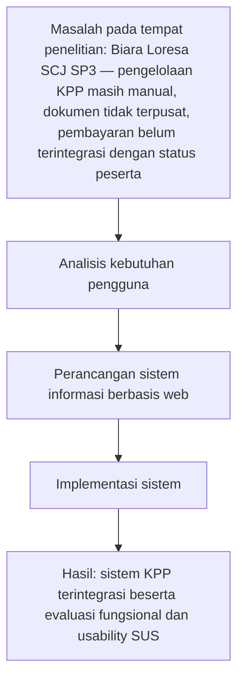

# Kerangka Berpikir

Kerangka berpikir pada penelitian ini menggambarkan alur logis perancangan dan implementasi sistem pendaftaran Kursus Persiapan Pernikahan (KPP) di Biara Loresa SCJ SP3. Alur diawali dari identifikasi masalah pada lokasi penelitian, yaitu proses pendaftaran yang masih manual, pengelolaan dokumen persyaratan yang belum terpusat, serta mekanisme pembayaran yang belum terintegrasi dengan status peserta. Berdasarkan permasalahan tersebut, penelitian dilanjutkan ke tahap analisis kebutuhan pengguna sebagai dasar untuk merancang solusi yang sesuai dengan kebutuhan operasional biara. Hasil analisis kemudian diterjemahkan ke dalam perancangan sistem informasi berbasis web yang menjadi acuan pada tahap implementasi.

Tahap implementasi menghasilkan sistem KPP terintegrasi yang mendukung proses pendaftaran, pengelolaan data, dan pembayaran digital secara lebih terstruktur. Setelah sistem diterapkan, penelitian dilanjutkan dengan evaluasi fungsional untuk memastikan setiap fitur berjalan sesuai kebutuhan yang telah ditetapkan pada tahap analisis. Selain itu, pengukuran usability menggunakan System Usability Scale (SUS) dilakukan untuk menilai tingkat kemudahan penggunaan sistem dari sudut pandang pengguna. Dengan demikian, kerangka berpikir ini menegaskan keterkaitan antar tahap penelitian dari identifikasi masalah hingga diperoleh hasil sistem yang dapat dipertanggungjawabkan secara akademik.

*Keterangan:* Diagram menunjukkan keterhubungan antar tahap penelitian secara berurutan, mulai dari identifikasi masalah, analisis kebutuhan, perancangan, implementasi, hingga evaluasi hasil.
