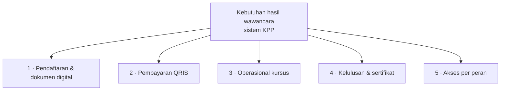

# Requirement

## Kata Pengantar

Bagian Requirement menjadi landasan pengembangan sistem pendaftaran Kursus Persiapan Pernikahan (KPP) berbasis web di Biara Loresa SCJ SP3. Kebutuhan mengacu pada wawancara, observasi, folder `Kebutuhan user`, dan implementasi pada folder `Program`, sebagai acuan Product Backlog, Sprint Planning, dan prioritas fitur.

Wawancara pada 15 Februari 2026 dengan Pastor Markus Apriyono (Direktur Biara) menunjukkan layanan KPP masih manual: pendaftaran, dokumen, dan administrasi biaya terpisah sehingga data kurang teratur dan verifikasi lambat. Pengembangan difokuskan pada aplikasi web terintegrasi: pendaftaran online, unggah dan verifikasi dokumen, pembayaran QRIS (Midtrans), serta dashboard peserta dan admin untuk periode kursus, materi, kehadiran, biaya tambahan, dan sertifikat.

## Kebutuhan Hasil Wawancara

Wawancara dilaksanakan pada **15 Februari 2026** di Biara Loresa SCJ SP3 bersama **Pastor Markus Apriyono** selaku Direktur Biara. Berikut dirumuskan kebutuhan utama yang diperoleh dari hasil wawancara, dilengkapi uraian singkat.

| No | Kebutuhan hasil wawancara | Keterangan |
| --- | --- | --- |
| 1 | Pendaftaran web dan dokumen digital | Registrasi daring tanpa kunjungan fisik semata untuk tahap awal; unggah berkas untuk diperiksa pengelola; menggantikan map kertas. |
| 2 | Pembayaran non-tunai lewat QRIS | Alur biaya administrasi tercatat, cepat, dan mudah diaudit; disalurkan melalui QRIS dengan penyedia Midtrans. |
| 3 | Pengelolaan operasional kursus | Penjadwalan buka dan tutup layanan, materi beserta jadwal, kehadiran, serta keterbukaan rincian biaya tambahan. |
| 4 | Kelulusan dan sertifikat | Pengumuman resmi dan dokumen bukti bagi pasangan yang telah memenuhi ketentuan. |
| 5 | Akses berdasarkan peran | Ruang kerja terpisah untuk peserta, admin, dan super admin dengan otorisasi yang ketat. |

Diagram ringkas kebutuhan hasil wawancara:

Kebutuhan perangkat lunak pendukung penelitian dan pengembangan diuraikan pada subbab berikut.

## Kebutuhan Perangkat Lunak dan Biaya Dasar

Tabel berikut memuat perangkat lunak yang dipakai dalam penelitian dan pengembangan beserta fungsi singkat dan gambaran biaya.

| No. | Komponen | Fungsi | Biaya |
| --- | -------- | ------ | ----- |
| 1 | Domain (`biaraloresa.my.id`) | Akses publik aplikasi web. | Tarif registrar; contoh domain `.my.id` tahun pertama **Rp5.500**. |
| 2 | Laravel | Framework backend aplikasi (sesuai folder `Program`). | Gratis (sumber terbuka). |
| 3 | Mermaid | Diagram pada dokumen Markdown (dokumentasi/naskah). | Gratis (sumber terbuka). |
| 4 | Cursor | Editor pengembangan dengan dukungan AI. | Sesuai paket penyedia (ada versi gratis terbatas). |
| 5 | GitHub | Repositori kode dan version control. | Gratis untuk penggunaan dasar. |
| 6 | Sumopod | Pendukung dokumentasi/arsip penelitian. | Sesuai kebijakan penyedia jika berbayar. |

Domain memiliki angka tarif contoh pada tabel; Laravel, Mermaid, dan GitHub umumnya tanpa biaya lisensi untuk keperluan penelitian. Cursor dan Sumopod mengikuti paket penyedia bila menggunakan fitur berbayar.

Rumusan requirement ini menjadi dasar Product Backlog dan sprint berikutnya, selaras dengan kebutuhan pengguna, operasional Biara Loresa SCJ, dan implementasi pada folder `Program`.
