# Product Backlog

## Kata Pengantar

Product Backlog menerjemahkan kebutuhan sistem menjadi daftar pekerjaan terukur dan terprioritas berdasarkan Requirement, `Kebutuhan user`, dan kesesuaian dengan folder `Program`. Penyusunannya memungkinkan pelaksanaan sprint yang fokus, bertahap, dan selaras dengan tujuan penelitian. Setiap item memiliki tujuan yang jelas sehingga dapat dieksekusi per sprint dan mendukung Sprint Planning serta evaluasi increment secara sistematis menurut Agile Scrum. Urutan prioritas mengikuti nilai bisnis dan kebutuhan pengguna agar pengembangan sistem informasi tetap terarah.

## Daftar Product Backlog

| ID    | Product Backlog item                                 | Deskripsi singkat                                                 | Prioritas | Sprint   |
| ----- | ---------------------------------------------------- | ----------------------------------------------------------------- | --------- | -------- |
| PB-01 | Registrasi dan autentikasi pengguna                  | Login, logout, dan pengelolaan akun sesuai peran.                 | Tinggi    | Sprint 1 |
| PB-02 | Pendaftaran KPP online                               | Alur pendaftaran kursus pernikahan berbasis web.                  | Tinggi    | Sprint 1 |
| PB-03 | Upload dokumen persyaratan                           | Unggah berkas persyaratan oleh peserta secara digital.            | Tinggi    | Sprint 1 |
| PB-04 | Verifikasi dokumen oleh admin                        | Persetujuan/penolakan dokumen per item dan status keseluruhan.    | Tinggi    | Sprint 2 |
| PB-05 | Integrasi pembayaran QRIS                            | Pembayaran non-tunai melalui Midtrans/QRIS.                       | Tinggi    | Sprint 2 |
| PB-06 | Monitoring status pendaftaran peserta                | Dashboard user untuk status pendaftaran, dokumen, dan pembayaran. | Tinggi    | Sprint 2 |
| PB-07 | Manajemen periode kursus                             | CRUD periode serta buka/tutup pendaftaran per periode.            | Sedang    | Sprint 3 |
| PB-08 | Manajemen materi dan pengiriman informasi            | Materi per periode dan penyampaian informasi jadwal/materi.       | Sedang    | Sprint 3 |
| PB-09 | Manajemen kehadiran peserta                          | Pencatatan kehadiran peserta per periode kursus.                  | Sedang    | Sprint 3 |
| PB-10 | Manajemen biaya tambahan                             | Pengelolaan komponen biaya di luar biaya utama.                   | Sedang    | Sprint 4 |
| PB-11 | Pengelolaan sertifikat kelulusan                     | Pembuatan, pengelolaan, dan distribusi sertifikat peserta lulus.  | Sedang    | Sprint 4 |
| PB-12 | Dashboard monitoring admin dan super admin           | Ringkasan data operasional untuk pemantauan layanan.              | Sedang    | Sprint 4 |
| PB-13 | Notifikasi informasi layanan                         | Informasi terkait jadwal, status, atau dokumen kepada peserta.    | Rendah    | Sprint 4 |
| PB-14 | Pengelolaan profil dan keamanan akun                 | Pembaruan profil dan kata sandi oleh pengguna.                    | Rendah    | Sprint 4 |

Diagram berikut menyajikan **tabel Product Backlog** dalam **bentuk pohon berakar**: satu simpul akar (*root*) di puncak, empat cabang sprint sesuai kolom Sprint, dan simpul daun berisi PB-01–PB-14 beserta prioritas serta nama item seperti pada tabel.

```mermaid
flowchart TB
    ROOT(("Product Backlog<br/>Sistem KPP"))

    ROOT --> SP1[Sprint 1]
    ROOT --> SP2[Sprint 2]
    ROOT --> SP3[Sprint 3]
    ROOT --> SP4[Sprint 4]

    SP1 --> P01["PB-01 · Tinggi · Registrasi dan autentikasi pengguna"]
    SP1 --> P02["PB-02 · Tinggi · Pendaftaran KPP online"]
    SP1 --> P03["PB-03 · Tinggi · Upload dokumen persyaratan"]

    SP2 --> P04["PB-04 · Tinggi · Verifikasi dokumen oleh admin"]
    SP2 --> P05["PB-05 · Tinggi · Integrasi pembayaran QRIS"]
    SP2 --> P06["PB-06 · Tinggi · Monitoring status pendaftaran peserta"]

    SP3 --> P07["PB-07 · Sedang · Manajemen periode kursus"]
    SP3 --> P08["PB-08 · Sedang · Manajemen materi dan pengiriman informasi"]
    SP3 --> P09["PB-09 · Sedang · Manajemen kehadiran peserta"]

    SP4 --> P10["PB-10 · Sedang · Manajemen biaya tambahan"]
    SP4 --> P11["PB-11 · Sedang · Pengelolaan sertifikat kelulusan"]
    SP4 --> P12["PB-12 · Sedang · Dashboard monitoring admin dan super admin"]
    SP4 --> P13["PB-13 · Rendah · Notifikasi informasi layanan"]
    SP4 --> P14["PB-14 · Rendah · Pengelolaan profil dan keamanan akun"]
```

Gambar 3.5 Diagram Product Backlog bentuk pohon berakar

## Prioritas Pengembangan

Prioritas tinggi difokuskan pada fitur inti layanan, yaitu pendaftaran, dokumen, verifikasi, pembayaran QRIS, dan pemantauan status peserta. Prioritas sedang diarahkan pada pengelolaan operasional kursus oleh admin, sedangkan prioritas rendah digunakan untuk fitur pendukung agar kualitas layanan lebih optimal. Urutan backlog ini menjadi acuan pada tahap Sprint Planning agar implementasi sistem informasi tetap konsisten dengan kebutuhan pengguna pada `Kebutuhan user`.