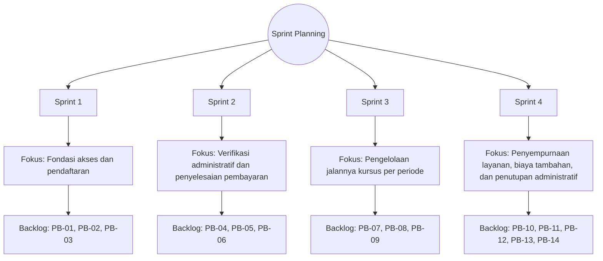

# Sprint Planning

## Tujuan Sprint Planning

Tahap Sprint Planning menetapkan tujuan sprint, memilih backlog item yang akan dikerjakan, serta membagi pekerjaan ke dalam periode pengembangan yang terukur, dengan perencanaan yang disusun berdasarkan prioritas pada `Product Backlog`, kebutuhan pengguna pada `Kebutuhan user`, serta kesesuaian implementasi fitur pada tahap pengembangan sistem informasi. Melalui tahap ini, ruang lingkup pekerjaan pada setiap sprint diitetapkan dan backlog diprioritaskan agar memberikan nilai setinggi-tingginya bagi layanan KPP. Selanjutnya dirumuskan target hasil berupa increment yang dapat diuji pada akhir sprint. Pengembangan tetap dijaga selaras dengan kebutuhan pengguna dan tujuan penelitian.

## Rencana Sprint

Kolom **Fokus sprint** pada tabel berikut dijelaskan secara rinci agar ruang lingkup pekerjaan, tujuan teknis, dan hubungannya dengan item backlog pada setiap periode pengembangan tampak jelas.

| Sprint   | Fokus sprint                                                                                                                                                                                                                                                                          | Backlog utama                     |
| -------- | ------------------------------------------------------------------------------------------------------------------------------------------------------------------------------------------------------------------------------------------------------------------------------------- | --------------------------------- |
| Sprint 1 | **Fondasi akses dan pendaftaran.** Sprint ini mengutamakan pembangunan jalur masuk pengguna melalui registrasi dan autentikasi sesuai peran sehingga akun peserta dan admin terpisah secara aman.                                                                                     | PB-01, PB-02, PB-03               |
| Sprint 2 | **Verifikasi administratif dan penyelesaian pembayaran.** Setelah dokumen masuk, sprint ini mengarah pada peran admin untuk memeriksa kelengkapan dan validitas berkas, memberi status persetujuan atau penolakan per item, serta menjaga konsistensi status keseluruhan pendaftaran. | PB-04, PB-05, PB-06               |
| Sprint 3 | **Pengelolaan jalannya kursus per periode.** Admin dapat mendefinisikan dan mengatur periode kursus—termasuk membuka atau menutup pendaftaran—agar pelaksanaan KPP terorganisir per angkatan.                                                                                         | PB-07, PB-08, PB-09               |
| Sprint 4 | **Penyempurnaan layanan, biaya tambahan, dan penutupan administratif.** Komponen biaya di luar biaya utama dilengkapi agar transparansi administrasi terjaga; sertifikat dan distribusi kelulusan dikelola sesuai ketentuan lembaga.                                                  | PB-10, PB-11, PB-12, PB-13, PB-14 |

Diagram berikut menyajikan **Sprint Planning dalam bentuk pohon berakar**: satu simpul akar di puncak, bercabang ke Sprint 1-4 sesuai tabel, lalu diturunkan ke fokus sprint, backlog utama, dan petunjuk implementasi pada folder `Program`.

## Mekanisme Perencanaan

Pada setiap awal sprint, tim menetapkan sprint goal, memilih item backlog sesuai kapasitas kerja, lalu memecah item menjadi tugas yang lebih rinci untuk pelaksanaan harian. Hasil dari setiap sprint dievaluasi melalui pengujian fungsional terhadap alur utama sistem, sehingga perbaikan dapat langsung direncanakan pada sprint berikutnya.

Dengan pendekatan ini, proses pengembangan sistem informasi berlangsung bertahap, terukur, dan tetap mengacu pada kebutuhan nyata yang dihimpun dalam `Kebutuhan user`.