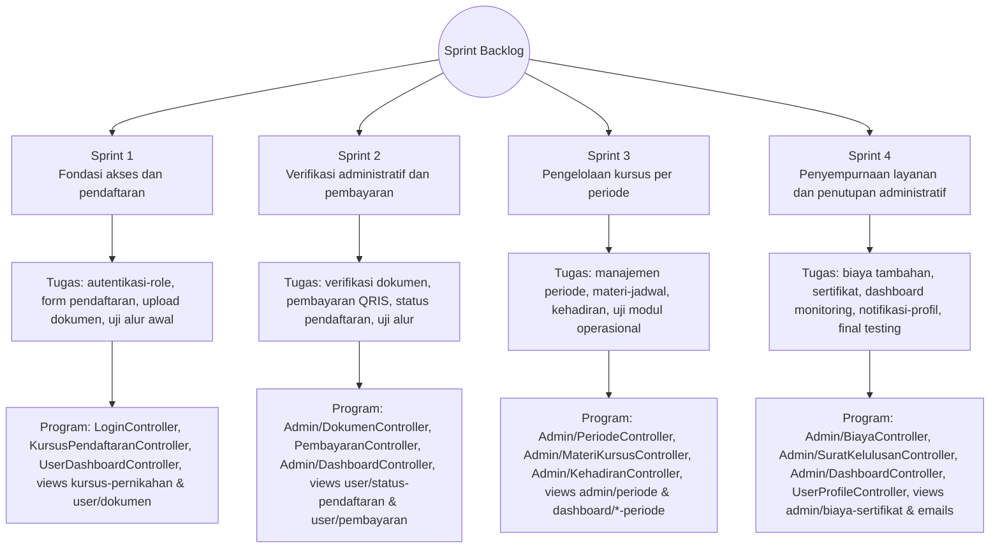

# Sprint Backlog

Sprint Backlog adalah turunan dari Product Backlog yang dipilih saat Sprint Planning, kemudian dipecah menjadi tugas-tugas teknis untuk setiap sprint. Pada penelitian ini, Sprint Backlog menghasilkan daftar tugas operasional yang siap dikerjakan oleh tim pengembang, menjadi acuan pelaksanaan Daily Scrum, serta dasar evaluasi pada Sprint Review dan Sprint Retrospective agar pengembangan tetap terarah, terukur, dan selaras dengan kebutuhan pada `Kebutuhan user`.

## Sprint Backlog per Sprint

| Sprint   | Fokus Sprint                                                       | Tugas Utama Sprint Backlog                                                                                                                                                                                         |
| -------- | ------------------------------------------------------------------ | ------------------------------------------------------------------------------------------------------------------------------------------------------------------------------------------------------------------ |
| Sprint 1 | Fondasi akses dan pendaftaran                                      | Menyusun autentikasi dan role pengguna, membangun form pendaftaran KPP online, mengembangkan upload dokumen persyaratan, serta melakukan uji fungsional alur pendaftaran awal.                                     |
| Sprint 2 | Verifikasi administratif dan penyelesaian pembayaran               | Membangun verifikasi dokumen per item oleh admin, mengintegrasikan pembayaran QRIS (Midtrans), menyediakan halaman status pendaftaran peserta, serta menguji alur verifikasi dan pembayaran.                       |
| Sprint 3 | Pengelolaan jalannya kursus per periode                            | Mengembangkan manajemen periode kursus, modul materi dan pengiriman informasi jadwal, modul pencatatan kehadiran peserta, serta uji fungsional modul operasional kursus.                                           |
| Sprint 4 | Penyempurnaan layanan, biaya tambahan, dan penutupan administratif | Mengembangkan modul biaya tambahan dan sertifikat, menyempurnakan dashboard admin/super admin, mengimplementasikan notifikasi dan pengelolaan profil pengguna, serta final testing end-to-end dan perbaikan akhir. |

## Rincian Tugas Sprint Backlog

| Sprint | No Tugas | Rincian Tugas Sprint Backlog |
| --- | --- | --- |
| Sprint 1 | 1 | Menyusun alur autentikasi dan pembagian role pengguna (admin dan peserta). |
| Sprint 1 | 2 | Membangun form pendaftaran KPP online serta validasi data pendaftaran. |
| Sprint 1 | 3 | Mengembangkan fitur unggah dokumen persyaratan oleh peserta. |
| Sprint 1 | 4 | Melakukan uji fungsional alur pendaftaran awal (registrasi sampai dokumen). |
| Sprint 2 | 1 | Membangun fitur verifikasi dokumen per item oleh admin (setuju/tolak). |
| Sprint 2 | 2 | Mengintegrasikan pembayaran QRIS melalui Midtrans pada alur pendaftaran. |
| Sprint 2 | 3 | Menyediakan halaman status pendaftaran agar peserta memantau progres. |
| Sprint 2 | 4 | Melakukan pengujian alur verifikasi dokumen dan pembayaran. |
| Sprint 3 | 1 | Mengembangkan modul manajemen periode kursus (tambah, ubah, buka/tutup). |
| Sprint 3 | 2 | Mengembangkan modul materi dan informasi jadwal per periode. |
| Sprint 3 | 3 | Mengembangkan modul pencatatan kehadiran peserta per periode. |
| Sprint 3 | 4 | Melakukan uji fungsional modul operasional kursus (periode, materi, kehadiran). |
| Sprint 4 | 1 | Mengembangkan modul biaya tambahan dan pengelolaan sertifikat kelulusan. |
| Sprint 4 | 2 | Menyempurnakan dashboard monitoring admin/super admin. |
| Sprint 4 | 3 | Mengimplementasikan notifikasi layanan dan pengelolaan profil pengguna. |
| Sprint 4 | 4 | Melakukan final testing end-to-end dan perbaikan akhir sebelum rilis. |

Diagram berikut menyajikan **Sprint Backlog dalam bentuk pohon berakar** berdasarkan isi tabel Sprint Backlog, lalu memetakan tugas tiap sprint ke implementasi pada folder `Program` (`app/Http/Controllers` dan `resources/views`).

Gambar 3.7 Diagram hubungan Sprint Backlog dengan Sprint Planning dan folder Program

## Catatan Pelaksanaan

Pada praktiknya, rincian tugas di atas dapat disesuaikan kembali saat sprint berjalan berdasarkan hasil Daily Scrum dan evaluasi sprint sebelumnya. Namun, ruang lingkup utama tetap mengacu pada backlog prioritas agar pengembangan sistem informasi konsisten dengan kebutuhan layanan yang diperoleh dari `Kebutuhan user`.