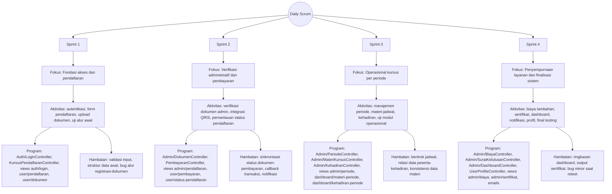

# Daily Scrum

Daily Scrum merupakan pertemuan harian singkat yang dilakukan selama sprint untuk memantau progres pekerjaan, menyelaraskan aktivitas tim, dan mengidentifikasi hambatan sedini mungkin. Pelaksanaan Daily Scrum pada penelitian ini berpedoman pada backlog yang telah disusun, kebutuhan pengguna pada `Kebutuhan user`, serta target implementasi fitur pada tahap pengembangan sistem informasi.

## Fungsi Daily Scrum

Daily Scrum dalam penelitian ini berfungsi sebagai pertemuan harian singkat untuk memantau progres sprint, memastikan pekerjaan sesuai Sprint Backlog, dan mengidentifikasi hambatan yang perlu segera diatasi agar target pengembangan sistem informasi tetap tercapai.

## Format Pelaporan Harian

Setiap sesi Daily Scrum membahas tiga poin utama:

1. Apa yang sudah dikerjakan sejak pertemuan sebelumnya.
2. Apa yang akan dikerjakan pada hari ini.
3. Hambatan yang dihadapi selama pengerjaan.

## Ringkasan Pelaksanaan Daily Scrum

| Sprint   | Fokus Utama Daily Scrum                     | Aktivitas Harian Utama                                                                                             | Hambatan yang Dipantau                                                                                          |
| -------- | ------------------------------------------- | ------------------------------------------------------------------------------------------------------------------ | --------------------------------------------------------------------------------------------------------------- |
| Sprint 1 | Fondasi akses dan pendaftaran               | Sinkronisasi progres autentikasi, form pendaftaran, unggah dokumen, dan uji alur awal.                             | Validasi input belum konsisten, struktur data awal belum seragam, serta bug pada alur registrasi-dokumen.       |
| Sprint 2 | Verifikasi administratif dan pembayaran     | Pemantauan pengerjaan verifikasi dokumen admin, integrasi QRIS Midtrans, dan halaman status pendaftaran.           | Ketidaksesuaian status dokumen dan pembayaran, keterlambatan callback transaksi, serta error notifikasi status. |
| Sprint 3 | Operasional kursus per periode              | Koordinasi harian modul periode, materi/jadwal, kehadiran, dan pengujian fungsional modul operasional.             | Bentrok jadwal per periode, relasi data peserta-kehadiran belum stabil, dan inkonsistensi data materi.          |
| Sprint 4 | Penyempurnaan layanan dan finalisasi sistem | Monitoring penyelesaian biaya tambahan, sertifikat, dashboard, notifikasi, profil, serta final testing end-to-end. | Perbedaan hasil tampilan dashboard, ketidaksesuaian output sertifikat, dan temuan bug minor saat retest akhir.  |

Diagram berikut menyajikan **Daily Scrum dalam bentuk pohon berakar** berdasarkan isi tabel, lalu memetakan fokus aktivitas harian ke implementasi pada folder `Program`.

## Hasil Daily Scrum

Melalui Daily Scrum, tim dapat menjaga ritme kerja sprint, mendeteksi hambatan lebih awal, dan memastikan pengembangan sistem informasi tetap selaras dengan `Kebutuhan user`.