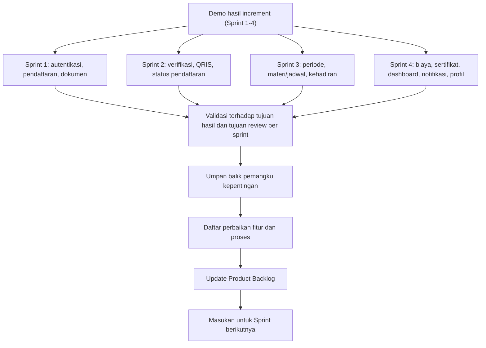

# Sprint Review

Pada penelitian ini, Sprint Review dilaksanakan pada penutupan setiap sprint untuk memastikan hasil implementasi benar-benar sejalan dengan tujuan sprint, backlog prioritas, dan kebutuhan layanan KPP. Kegiatan review dilakukan dengan mempresentasikan increment yang sudah berjalan pada sisi peserta dan admin, menelaah hasil pengujian, lalu menetapkan perbaikan yang perlu dimasukkan ke backlog berikutnya agar kualitas sistem meningkat secara bertahap.

## Tujuan Sprint Review

1. Memvalidasi apakah increment sprint telah memenuhi target fungsional.
2. Menunjukkan hasil pengembangan kepada pemangku kepentingan untuk memperoleh umpan balik.
3. Mengidentifikasi penyesuaian backlog untuk sprint berikutnya.
4. Menjamin arah pengembangan tetap sesuai kebutuhan layanan pada `Kebutuhan user`.

## Tabel Sprint Review

| Sprint   | Tujuan Hasil Sprint                                                                                                             | Tujuan Review Sprint                                                                                                                                             |
| -------- | ------------------------------------------------------------------------------------------------------------------------------- | ---------------------------------------------------------------------------------------------------------------------------------------------------------------- |
| Sprint 1 | Menghasilkan fondasi layanan digital melalui autentikasi, pendaftaran online, dan unggah dokumen yang berjalan pada alur utama. | Memastikan alur dasar peserta berfungsi dengan baik, memeriksa kualitas validasi form, dan menetapkan perbaikan awal untuk sprint berikutnya.                    |
| Sprint 2 | Menghasilkan proses verifikasi dokumen dan pembayaran QRIS yang terintegrasi dengan status pendaftaran peserta.                 | Memastikan konsistensi status verifikasi-pembayaran, mengevaluasi kejelasan informasi status peserta, dan menyusun penyesuaian logika proses.                    |
| Sprint 3 | Menghasilkan modul operasional kursus per periode meliputi pengelolaan periode, materi/jadwal, dan kehadiran.                   | Memastikan kestabilan alur operasional admin, meninjau sinkronisasi data periode, dan menetapkan perbaikan relasi data serta jadwal.                             |
| Sprint 4 | Menghasilkan penyempurnaan layanan melalui fitur biaya tambahan, sertifikat, dashboard, notifikasi, dan profil akun.            | Memastikan integrasi seluruh modul end-to-end, mengevaluasi kualitas tampilan ringkasan informasi, dan menutup backlog prioritas sebelum sistem dinyatakan siap. |

Diagram berikut menyajikan **Sprint Review dalam bentuk pohon berakar** berdasarkan isi tabel Sprint Review serta keterkaitannya dengan implementasi pada folder `Program`.

## Hasil Sprint Review per Sprint

| Sprint   | Increment yang Ditinjau                                                                                                                                                         | Hasil Review Spesifik                                                                                            | Umpan Balik Utama                                                                                                  | Tindak Lanjut Backlog                                                                                              |
| -------- | ------------------------------------------------------------------------------------------------------------------------------------------------------------------------------- | ---------------------------------------------------------------------------------------------------------------- | ------------------------------------------------------------------------------------------------------------------ | ------------------------------------------------------------------------------------------------------------------ |
| Sprint 1 | Autentikasi, pendaftaran online, dan unggah dokumen (`LoginController`, `KursusPendaftaranController`, `user/pendaftaran`, `user/dokumen`)                                      | Alur registrasi akun sampai penyimpanan dokumen berhasil pada skenario utama peserta.                            | Validasi beberapa field masih terlalu ketat dan pesan kesalahan belum informatif.                                  | Menyederhanakan aturan validasi, memperjelas pesan error, dan merapikan alur input form.                           |
| Sprint 2 | Verifikasi dokumen admin, pembayaran QRIS, dan status pendaftaran (`Admin/DokumenController`, `PembayaranController`, `user/status-pendaftaran`)                                | Verifikasi dokumen dan proses pembayaran dapat dijalankan, serta status pendaftaran dapat berubah sesuai proses. | Sinkronisasi status verifikasi dan status pembayaran perlu dibuat lebih konsisten pada beberapa kondisi transaksi. | Penyesuaian logika pembaruan status, validasi callback pembayaran, dan penyempurnaan tampilan status peserta.      |
| Sprint 3 | Pengelolaan periode, materi/jadwal, dan kehadiran (`Admin/PeriodeController`, `Admin/MateriKursusController`, `Admin/KehadiranController`)                                      | Fitur operasional kursus per periode sudah berjalan dan data utama dapat dikelola admin.                         | Ditemukan kebutuhan sinkronisasi lebih baik antara jadwal materi dan data peserta per periode.                     | Perbaikan relasi data periode, validasi jadwal, dan pengujian ulang skenario operasional harian.                   |
| Sprint 4 | Biaya tambahan, sertifikat, dashboard, notifikasi, dan profil (`Admin/BiayaController`, `Admin/SuratKelulusanController`, `Admin/DashboardController`, `UserProfileController`) | Integrasi fitur pendukung selesai dan alur layanan dari pendaftaran hingga pasca-kelulusan berjalan end-to-end.  | Masih diperlukan perapian minor pada antarmuka dashboard dan konsistensi beberapa informasi ringkasan.             | Finalisasi antarmuka, retest end-to-end, dan penutupan backlog prioritas sebelum sistem dinyatakan siap digunakan. |

## Dampak Sprint Review

Melalui Sprint Review, setiap increment pada penelitian ini divalidasi secara bertahap dan dikaitkan langsung dengan kebutuhan layanan KPP. Umpan balik dari hasil demonstrasi dan pengujian digunakan untuk memperbarui prioritas backlog, sehingga pengembangan tetap terukur, adaptif, dan selaras dengan `Kebutuhan user`.