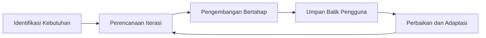
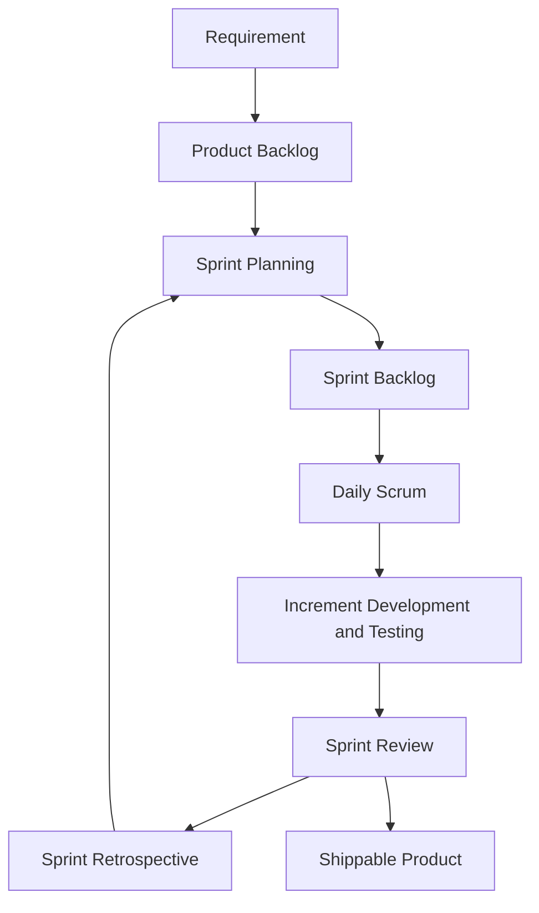

# Prosedur Penelitian

Prosedur penelitian ini disusun sebagai pedoman untuk merancang dan mengimplementasikan sistem pendaftaran Kursus Persiapan Pernikahan (KPP) berbasis web di Biara Loresa SCJ SP3 berdasarkan hasil wawancara, observasi lapangan, dokumen pada folder `Kebutuhan user`, dan kesesuaian implementasi pada folder `Program`. Penelitian menggunakan pendekatan Agile karena pengembangan sistem dilakukan secara iteratif, kolaboratif, dan adaptif terhadap perubahan kebutuhan pengguna. Metode yang digunakan adalah Scrum, yaitu kerangka kerja yang membagi proses pengembangan ke dalam siklus sprint mulai dari requirement, backlog, perencanaan, implementasi, pengujian increment, hingga evaluasi. Melalui prosedur ini, setiap tahap pengembangan dapat ditinjau dan disempurnakan secara terukur sampai menghasilkan sistem yang siap digunakan.

## Pendekatan Penelitian (Agile)

Pendekatan penelitian yang digunakan adalah Agile. Pendekatan ini menekankan proses iteratif, kolaborasi aktif dengan pengguna, dan kemampuan adaptasi terhadap perubahan kebutuhan selama pengembangan sistem berlangsung.

Gambar 3.2 Kerangka Pendekatan Agile

Diagram pendekatan Agile menunjukkan siklus berulang dari identifikasi kebutuhan, perencanaan, pengembangan, umpan balik, hingga adaptasi. Pola ini memastikan sistem yang dikembangkan tetap relevan dengan kebutuhan nyata pengguna pada layanan KPP.

## Metode Pengembangan Sistem (Scrum)

Metode pengembangan sistem yang digunakan adalah Scrum sebagai kerangka kerja dalam pendekatan Agile. Metode ini dipilih karena mampu membagi pekerjaan ke dalam sprint, mengatur prioritas fitur melalui backlog, memantau progres harian, serta mengevaluasi hasil increment secara berkala sampai sistem siap digunakan.

Gambar 3.3 Kerangka Metode Scrum

Diagram metode Scrum memperlihatkan alur operasional pengembangan mulai dari requirement hingga shippable product. Setelah Sprint Retrospective, proses kembali ke Sprint Planning untuk sprint berikutnya hingga seluruh kebutuhan prioritas sistem terpenuhi.
